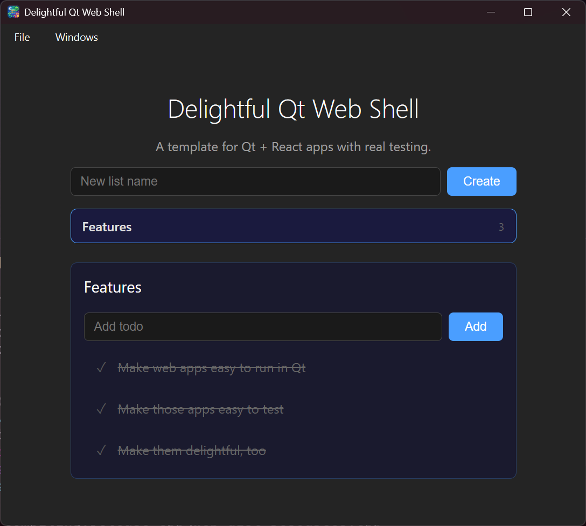

# Delightful Qt Web Shell

A template for building desktop apps with **Qt WebEngine + React** — with five layers of automated testing that actually work.

The core insight: a generic WebSocket bridge makes your C++ backend testable from *any* JavaScript test runner, without writing a single line of glue code per method.



## Architecture

```
┌──────────────────────────────────────────────────────┐
│  Qt Desktop Shell                                    │
│  ┌────────────┐    QWebChannel    ┌───────────────┐  │
│  │   React    │◄──────────────────►│   Bridge     │  │
│  │   (Vite)   │                   │  (QObject)    │  │
│  └────────────┘                   └───────┬───────┘  │
│   WebEngine                               │          │
└───────────────────────────────────────────┼──────────┘
                                            │
  Production: QWebChannel (in-process)      │  Q_INVOKABLE
  Dev/Test:   WebSocket JSON-RPC            │
                                            │
                                     ┌──────┴───────┐
                                     │  TodoStore   │
                                     │  (pure C++)  │
                                     └──────────────┘
```

In production, the React app talks to C++ through QWebChannel — same process, zero serialization overhead. In dev and test, the same Bridge is exposed over WebSocket, so Playwright, Bun, or a browser can call it identically.

## The Pattern: Zero-Boilerplate Bridging

### C++ side: `expose_as_ws()`

Give it any QObject. It introspects `Q_INVOKABLE` methods via `QMetaObject` and dispatches WebSocket JSON-RPC calls to them. Signals are forwarded as events. No per-method routing code.

```cpp
// test_server.cpp — the entire file
Bridge bridge;
auto* server = expose_as_ws(&bridge, 9876);
```

Your Bridge just follows one convention: Q_INVOKABLE methods take `QString` args and return JSON `QString`.

```cpp
class Bridge : public QObject {
    Q_OBJECT
    TodoStore store_;
public:
    Q_INVOKABLE QString listLists() {
        // ... serialize store_.list_lists() to JSON
    }
    Q_INVOKABLE QString addItem(const QString& listId, const QString& text) {
        auto item = store_.add_item(listId.toStdString(), text.toStdString());
        emit dataChanged();
        return /* JSON */;
    }
signals:
    void dataChanged();  // auto-forwarded as {"event":"dataChanged"}
};
```

### TypeScript side: `createWsBridge<T>()` and `createQtBridge<T>()`

Both bridges are `Proxy`-based. Zero per-method code. The interface *is* the implementation.

```typescript
interface TodoBridge {
  listLists(): Promise<TodoList[]>
  addItem(listId: string, text: string): Promise<TodoItem>
  onDataChanged(callback: () => void): () => void
}

// Works over WebSocket (dev/test):
const bridge = createWsBridge<TodoBridge>('ws://localhost:9876')

// Works over QWebChannel (production):
const bridge = createQtBridge<TodoBridge>()

// Either way:
const lists = await bridge.listLists()
```

### Convention-based event subscriptions

Methods starting with `on` + a capital letter automatically become event subscriptions. No hardcoding per signal.

```typescript
bridge.onDataChanged(() => refresh())   // → listens for "dataChanged"
bridge.onItemAdded(() => recount())     // → listens for "itemAdded"
```

On the C++ side, `expose_as_ws()` already forwards all parameterless signals as events. On the TypeScript side, both `createWsBridge` and `createQtBridge` detect the `on*` convention and wire up listeners automatically. Add a new signal to your QObject, add it to your TypeScript interface, done.

### Auto-detection

The React app doesn't care which bridge it's using:

```typescript
export function createBridge(): TodoBridge {
  if (window.qt?.webChannelTransport)
    return createQtBridge<TodoBridge>()      // production (QWebChannel)
  else
    return createWsBridge<TodoBridge>(wsUrl)  // dev/test (WebSocket)
}
```

## Five Testing Layers

### 1. C++ Unit Tests (Catch2)

Pure domain logic. No Qt, no network, no serialization. Fast.

```cpp
TEST_CASE("toggle_item flips done state") {
    TodoStore store;
    auto list = store.add_list("List");
    auto item = store.add_item(list.id, "Task");
    REQUIRE(item.done == false);

    auto toggled = store.toggle_item(item.id);
    REQUIRE(toggled.done == true);
}
```

```
xmake run test-todo-store
# 33 assertions in 11 test cases
```

### 2. TypeScript Unit Tests (Bun)

Tests the WebSocket Proxy bridge protocol against a mock server. Verifies JSON-RPC message format, argument passing, error handling, event subscriptions, and cleanup.

```typescript
test('sends args for methods with parameters', async () => {
  const received: any[] = []
  const server = startServer((ws, data) => {
    received.push(data)
    ws.send(JSON.stringify({ id: data.id, result: { id: '1', name: 'Test' } }))
  })

  const bridge = createWsBridge<TodoBridge>(`ws://localhost:${server.port}`)
  await bridge.addList('Groceries')

  expect(received[0].method).toBe('addList')
  expect(received[0].args).toEqual(['Groceries'])
})
```

```
xmake run test-bun
# 8 tests, 247ms
```

### 3. End-to-End Tests (Playwright)

Full stack: React UI + real C++ backend over WebSocket. Playwright drives a browser, types into inputs, clicks buttons, asserts on DOM state. The C++ `test-server` runs headless (no GUI).

```typescript
test('create a list and add todos', async ({ page }) => {
  await page.goto('/')

  await page.getByTestId('new-list-input').fill('Groceries')
  await page.getByTestId('create-list-button').click()

  const list = page.getByTestId('todo-list').filter({ hasText: 'Groceries' })
  await expect(list).toBeVisible()

  await list.click()
  await page.getByTestId('new-item-input').fill('Milk')
  await page.getByTestId('add-item-button').click()
  await expect(page.getByText('Milk')).toBeVisible()
})
```

```
xmake run test-e2e
# 4 tests against real C++ backend
```

You can also run against the Bun mock server:

```
BRIDGE_SERVER=bun xmake run test-e2e
```

### 4. CDP Smoke Tests (Playwright + QtWebEngine)

The nuclear option: launches the **real Qt desktop app**, connects to its WebEngine via Chrome DevTools Protocol, and verifies React rendered inside the native window.

QtWebEngine *is* Chromium, so `QTWEBENGINE_REMOTE_DEBUGGING=9222` gives you CDP for free. We use raw CDP instead of Playwright's `connectOverCDP` because QtWebEngine doesn't support `Browser.setDownloadBehavior`.

```typescript
test('Qt app renders the React heading', async () => {
  await launchQtApp()  // spawns the real .exe with CDP enabled

  const wsUrl = await getPageDebugUrl()  // http://localhost:9222/json
  const headingText = await cdpEvaluate(wsUrl,
    `document.querySelector('[data-testid="heading"]')?.textContent || ''`
  )

  expect(headingText).toBe('Delightful Qt Web Shell')
})
```

```
xmake build desktop
xmake run test-smoke
# 2 tests — proves Qt actually renders the React app
```

### 5. All Together

```
xmake run test-all
# Catch2 → Bun → Playwright e2e (sequential)
```

## What Each Layer Proves

| Layer          | What breaks if this fails                |
| -------------- | ---------------------------------------- |
| Catch2         | Your domain logic is wrong               |
| Bun            | Your bridge protocol is wrong            |
| Playwright e2e | Your UI + backend integration is wrong   |
| CDP smoke      | Qt isn't rendering your React app at all |

The first three are fast and reliable. The smoke tests are slower and can be flaky (GPU, window manager) — run them in CI, don't gate on them locally.

## Dev Mode

For development with hot module replacement:

```bash
# Terminal 1: Vite dev server
cd web && bun run dev

# Terminal 2: Qt desktop pointing at Vite
xmake run desktop -- --dev
```

The `--dev` flag tells the Qt shell to load from `http://localhost:5173` instead of the embedded resources. QWebChannel still works — the bridge script is injected into any page by WebEngine. Edit a React component, save, and see it update instantly inside the native Qt window.

For browser-only development (no Qt at all):

```bash
# Terminal 1: C++ backend over WebSocket
xmake run test-server

# Terminal 2: Vite dev server
cd web && bun run dev

# Open http://localhost:5173 in any browser
```

The React app auto-detects QWebChannel vs WebSocket — same code, both paths.

## Getting Started

### Prerequisites

- [xmake](https://xmake.io)
- [Qt 6.x](https://www.qt.io) with these modules installed:
  - **Qt WebEngine** — the Chromium-based web view
  - **Qt WebChannel** — bridge between C++ and JavaScript
  - **Qt WebSockets** — for the test server and dev/test bridge
  - **Qt Positioning** — required by WebEngine at runtime
- [Bun](https://bun.sh)
- [Node.js](https://nodejs.org) (for Playwright)
- **Linux only:** `libnss3-dev` and `libasound2-dev` (Chromium dependencies)

### Build and Run

```bash
# Configure (point to your Qt installation)
xmake f --qt=/path/to/qt  # e.g. C:/Qt/6.10.2/msvc2022_64 or ~/Qt/6.10.2/macos

# Build the desktop app (also builds the React app via Vite)
xmake build desktop

# Run it
xmake run desktop

# Install test dependencies
bun install
npx playwright install chromium

# Run all tests
xmake run test-all
```

### Project Structure

```
cpp/
  todo_store.hpp        Pure C++ domain logic (no Qt)
  bridge.hpp            QObject wrapper — Q_INVOKABLE methods
  expose_as_ws.hpp      Generic WebSocket adapter (QMetaObject introspection)
  test_server.cpp       Headless C++ test server (7 lines of real code)
  main.cpp              Qt desktop shell with WebEngine

web/
  src/api/bridge.ts     TodoBridge interface + WsBridge Proxy + QtBridge + auto-detect

test-server/
  server.ts             Bun WebSocket mock server (per-connection isolation)

tests/
  todo_store_test.cpp   Catch2 unit tests
  bridge_proxy_test.ts  Bun unit tests for the Proxy bridge

e2e/
  todo-lists.spec.ts    Playwright end-to-end tests (CRUD, toggle, isolation)

smoke/
  qt-renders-react.spec.ts  CDP smoke tests against real Qt app
```

## Cross-Platform

The template builds on Windows, macOS, and Linux. Platform-specific bits are guarded:

- `app.rc` (Windows icon/version info) — only compiled on Windows
- `gmtime_s` / `gmtime_r` — `#ifdef _MSC_VER` guard
- Build output paths — smoke tests auto-detect per `process.platform`

Everything else — Qt, C++ standard library, Vite, Playwright — is cross-platform by nature.

## License

Use however, no attribution required.

```
BSD Zero Clause License (SPDX: 0BSD)

Permission to use, copy, modify, and/or distribute this software for any purpose
with or without fee is hereby granted.

THE SOFTWARE IS PROVIDED "AS IS" AND THE AUTHOR DISCLAIMS ALL WARRANTIES WITH
REGARD TO THIS SOFTWARE INCLUDING ALL IMPLIED WARRANTIES OF MERCHANTABILITY AND
FITNESS. IN NO EVENT SHALL THE AUTHOR BE LIABLE FOR ANY SPECIAL, DIRECT,
INDIRECT, OR CONSEQUENTIAL DAMAGES OR ANY DAMAGES WHATSOEVER RESULTING FROM LOSS
OF USE, DATA OR PROFITS, WHETHER IN AN ACTION OF CONTRACT, NEGLIGENCE OR OTHER
TORTIOUS ACTION, ARISING OUT OF OR IN CONNECTION WITH THE USE OR PERFORMANCE OF
THIS SOFTWARE.
```
